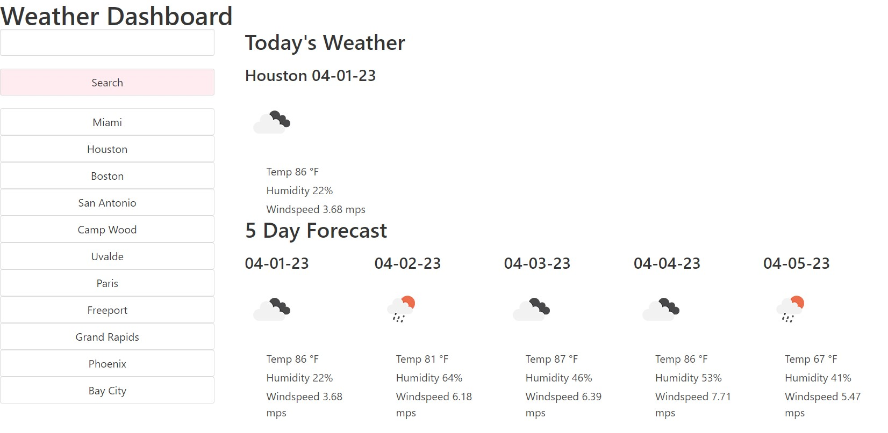

# Weather Dashboard

## Description

This is a webpage that displays weather for an inputed city. 

This webpage was a practice in:
- local storage
- HTML generation via JavaScript
- fetching API data
- DOM traversal of API data
- jQuery
- day.js
- Bulma 

## Installation

N/A

## Usage

Webpage: https://ctalv.github.io/weather_dashboard/

## Credits

Displaying Openweather API Icons: https://stackoverflow.com/questions/44177417/how-to-display-openweathermap-weather-icon answer by Elias Baraka Dyesse

CSS Framework Bulma: https://bulma.io/ 

## License

MIT License

# Module_6_Challenge

